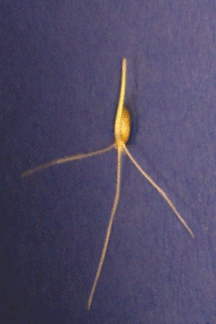

# Automating Root Angle measurement
\#phenoApps Hackathon - Cornell

Goal is to automate the measurement of the angle between the outer most roots of a wheat seed.

1. [Python notebook](Python-automated/Calculate-root-angles.ipynb) on automating angle measurement
2. TODO: Validate the algorithm on multiple images
3. TODO: Build corresponding Android application